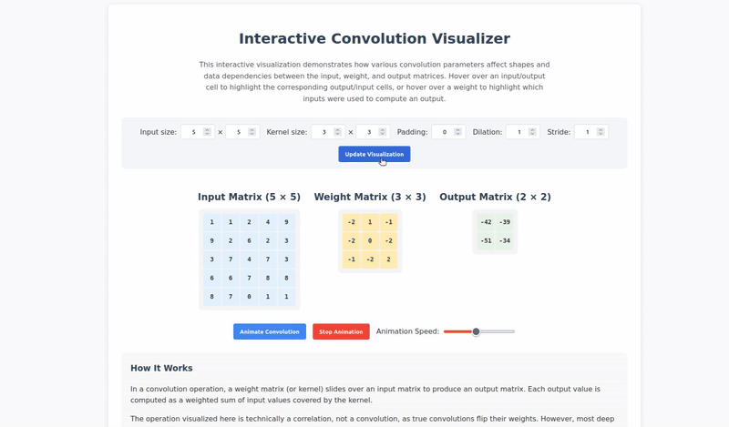

# Interactive Convolution Visualizer

An interactive web-based tool to visualize and understand convolution operations commonly used in deep learning and image processing.

## Features

- Interactive visualization of convolution operations
- Real-time parameter adjustment:
  - Input matrix size
  - Kernel (weight matrix) size
  - Padding
  - Dilation
  - Stride
- Animated convolution process
- Hover effects to show relationships between:
  - Input and output cells
  - Weight matrix elements
  - Corresponding regions

## How It Works

The visualizer demonstrates how convolution operations work by:

1. Showing the input matrix, weight matrix (kernel), and output matrix
2. Highlighting relationships between cells when hovering
3. Animating the convolution process step by step
4. Visualizing padding, stride, and dilation effects

## Usage

1. Open `index.html` in a web browser
2. Adjust parameters using the control panel:
   - Set input matrix dimensions
   - Set kernel size
   - Adjust padding, dilation, and stride values
3. Click "Update Visualization" to apply changes
4. Use "Animate Convolution" to see the process step by step
5. Hover over cells to see relationships:
   - Input cells show which outputs they affect
   - Weight cells show corresponding input-output pairs
   - Output cells show which inputs and weights contributed to them

## Parameters Explained

- **Input Size**: Dimensions of the input matrix
- **Kernel Size**: Dimensions of the weight matrix (kernel)
- **Padding**: Number of zero-valued cells added around the input
- **Dilation**: Spacing between kernel elements
- **Stride**: Step size when sliding the kernel

## Author

[Kowshik Deb Nath](https://github.com/kowshik24)
